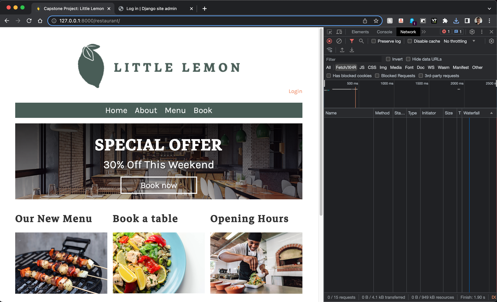

# Full Stack LittleLemon Restaurant Reservation System

This is a simple full-stack restaurant table reservation system, which is developed using Python, and Django, as part of a Meta Back-End Developer Developer Professional Certificate program to acquire the necessary skills to become a full-stack developer, focusing on in particular Python, as well as the Django Web / REST Framework, to build inevitably build out a full-stack application.

## Demo

You may view a [video](https://drive.google.com/file/d/1eLz3OGxykJXx00xmWnfGX-DeGv_Tt3Uj/view?usp=drive_link) (with audio commentary) demonstrating the functionality of the app:

[](https://drive.google.com/file/d/1eLz3OGxykJXx00xmWnfGX-DeGv_Tt3Uj/view?usp=drive_link)

## Installation and Setup

### Pre-requisites

- Install Python - [https://www.python.org/downloads/](https://www.python.org/downloads/)
- Install pipenv - `pip3 install pipenv` - allows you to create a virtual environment for the project, and isolate the project dependencies from the global scope, or other Python projects.
- Install MySQL - [https://www.mysql.com/downloads/](https://www.mysql.com/downloads/). Or install MySQL using [Homebrew](https://brew.sh/)
- Start / Run the MySQL server
- Create a MySQL database named (for example, `littlelemon_sayvai`) with the following command: `CREATE DATABASE littlelemon_sayvai;`

## Running the app

To install the app, clone the repository, and run the following command in the root directory of the project:

1. Clone the repository

If using SSH authentication:

```shell
git clone git@github.com:Sayvai/python-django-littlelemon.git
```

or, if using HTTPS authentication:

```shell
git clone https://github.com/Sayvai/python-django-littlelemon.git
```

ℹ️ - This step only needs to be done once, when you first install the app.

2. cd into the project directory. For example:

```shell
cd python-django-littlelemon
```

3. Create a virtual environment for the project via the terminal

```shell
pipenv shell
```

4. Install the dependencies via the terminal

```shell
pipenv install
```

ℹ️ - This step only needs to be done once, when you first install the app.

5. Configure the local database environment variables within the project-level `littlelemon/settings.py` file with the appropriate credentials. The default values are as follows:

```python
# settings.py

DATABASES = {
    "default": {
        "ENGINE": "django.db.backends.mysql",
        "NAME": "littlelemon_sayvai", # 👈 AMEND DATABASE NAME HERE. BEST TO USE A NEW UNIQUE DATABASE NAME TO AVOID CONFLICT DIFFERENCES
        "HOST": "127.0.0.1",
        "PORT": "3306",
        "USER": "admindjango", # 👈 AMEND DATABASE USER HERE
        "PASSWORD": "employee@123!", # 👈 AMEND DATABASE PASSWORD HERE
        "OPTIONS": {
            "init_command": "SET sql_mode='STRICT_TRANS_TABLES'"  # handles invalid or missing values from being stored in the database by INSERT and UPDATE statements
        },
    }
}
```

**Note**: if you want to create new credentials based on the example default values, then run the following SQL commands individually, from within the MySQL shell:

```sql
CREATE USER 'admindjango'@'localhost' IDENTIFIED BY 'employee@123!';
GRANT ALL PRIVILEGES ON littlelemon_sayvai.* TO 'admindjango'@'localhost';
FLUSH PRIVILEGES;
```

**Note**: Also ensure your MySQL server is currently running on port 3306 (default). If not, then change the port number in the `settings.py` file.

ℹ️ - This step only needs to be done once, when you first install the app.

6. Run the individual migration commands in your terminal to create the necessary database tables in the MySQL database (**_littlelemon_sayvai_**):

```shell
python3 manage.py makemigrations
python3 manage.py migrate
```

ℹ️ - This step only needs to be done once, when you first install the app.

7. Run the following command to start the Django development server:

```shell
python3 manage.py runserver
```

8. Create a super user admin account for the app via the terminal (e.g. username: `admin`, password: `admin` email: `admin@littlelemon.com`):

```shell
python3 manage.py createsuperuser
```

**Note:** if the prompt warns you the password is too common, then just press `y` to confirm you like to proceed with the password, and hit enter to continue.

ℹ️ - This step only needs to be done once, when you first install the app.

9. From within the [admin](http://127.0.0.1:8000/admin/) dashboard interface, create a new **Group** labelled as `Managers`, and assign the `admin` user to that group from within the [admin](http://127.0.0.1:8000/admin/) interface.

ℹ️ - This step only needs to be done once, when you first install the app.

10. Create a few menu items from within the admin interface dashboard at [http://127.0.0.1:8000/admin/](http://127.0.0.1:8000/admin/) by selecting the `+ Add` option to the right of the label `Menus` from within the left panel of the dashboard. Or, you could alternatively use your favourite REST client (e.g. Insomnia, Postman, etc), as long as you have generated and supply a valid token for the admin account in the request header (e.g. ` Authorization: "TOKEN 1234abge..."`), in which the token can also be obtained from the admin dashboard, or REST client ( `/auth/token/login/`).

You may populate the menu items model / table with the following examples, for inspiration:

```
name: "Edamame Beans"
price: "2.50"
inventory: "10"

name: "Chicken Katsu Curry"
price: "8.50"
inventory: "40"

name: "Prawn Katsu Curry"
price: "10.50"
inventory: "70"

name: "Salmon Teriyaki"
price: "11.50"
inventory: "50"

name: "Mochi Ice Cream"
price: "4.50"
inventory: "20"
```

ℹ️ - This step only needs to be done once, when you first install the app.

## Testing the app

The majority of the testing the listing of menu items derived from the database, and especially performing CRUD operations on table bookings, which can be performed on [http://127.0.0.1:8000/restaurant/](http://127.0.0.1:8000/restaurant/).

You should be able to perform the following actions from the LittleLemon front-end HTML webpages:

- [Register](http://127.0.0.1:8000/restaurant/register) a new customer user account.

- [Login](http://127.0.0.1:8000/restaurant/login) with the new customer

- View the [menu items](http://127.0.0.1:8000/restaurant/menu-list) from

- Manage [table bookings](http://127.0.0.1:8000/restaurant/booking)

## API Endpoints

You could also directly test the following endpoints via a REST client (e.g. Insomnia, Postman, etc):

- `/auth/token/login/` - [POST] This endpoint is used to obtain an authentication token by providing a valid username and password.

- `/auth/token/logout/`: [POST] This endpoint is used to revoke an authentication token.

- `restaurant/menu` - [GET] Retrieve all menu items. Anyone can access this endpoint.

- `restaurant/menu` - [POST] Create new menu items. Only authenticated managers users (e.g. admin) can access this endpoint, provided a valid token in the header, and data in the request body.

- `restaurant/menu/<int:pk>` - [GET, PUT, PATCH, DELETE] List and manipulate a menu item. Only authenticated managers users (e.g. admin) can access this endpoint, provided a valid token in the header, and data in the request body.

- `restaurant/tables` - [GET] Retrieve all table bookings for the currently authenticated valid user (token).

- `restaurant/tables` - [POST] Create new table booking for the currently authenticated valid user. Only authenticated users (e.g. admin, registered user) can access this endpoint, provided a valid token in the header, and data in the request body. No need to pass in `user` id to the payload, as the BE view logic automatically assigns the currently authenticated user to the table booking for the POST requests.

- `restaurant/tables/<int:pk>` - [GET, PUT, DELETE] Get and manipulate table booking for the currently authenticated valid user. Only authenticated users (e.g. admin, registered user) can access this endpoint, provided a valid token in the header.

## Unit Tests

The unit test cases are located in the `restaurant/tests/` app-level package directory.

To run the unit tests, run the following command in the terminal:

```shell
python3 manage.py test
```

## Troubleshooting

- if you encounter an error which states that the Django library is missing (or something similar) after running a CLI / shell command (e.g. `python3 manage.py ...`), then it is most likely that your virtual environment is not activated. To activate the virtual environment, run the following command from with the main root project directory in the terminal to activate the virtual environment, and then try running the previous command again:

```shell
pipenv shell
```

- if using VS Code, you could also automatically set the virtual environment to be activated when you open the project in VS Code. To do this, first find the active path of the activated pipenv shell, by typing on the terminal / shell `pipenv --venv`, and copy the output interpreter path for the pipenv environment for this project. Next, open the VS Code command palette, and type `Python: Select Interpreter`, and select the option `+ Enter interpreter path...`, and **paste** the project pipenv interpreter path you copied earlier, and then press the **enter** key. This will ensure that the virtual environment is automatically activated when you open the project in VS Code.

- if using the VS Code IDE, then you may also wish to debug the application in realtime using VS Code **Run and Debug** feature, whereby the configurations are located in `.vscode/launch.json`. Using the feature will run the Django development server for you, and will allow you to set breakpoints to pause code execution during runtime, where you may further inspect and debug variable values and output. To do so, simply click on the 'Run and Debug' icon on the side panel, and select the `Django: LittleLemon` option from the dropdown menu, and click on the **Run / Play** button.

## Technologies Used

- Python
- Django
- Django REST Framework (DRF)
- Djoser (for authentication)
- MySQL
- HTML
- CSS
- JavaScript
